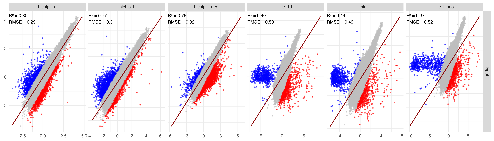

## Introduction

I’m Hyunmin, a bioinformatician from Korea.


My work focuses on challenging problems such as:

* Profiling dinosaur DNA
* Calculating CNVs from HiChIP
* Resolve Bioinformatics Heterogeneity Amplifying Signals from All-sick 
* Debugging Machine Languages in Perl, R, and Python that are difficult to deploy 


## CNV-HiChIP Tools Outline
```
    cnv prepare    # prepare sequence biases GC, Mappability, Restriction Engymes
    cnv peak       # CNV-aware peak caller 
    cnv calculate  # CNV calculator

```

## Prepare mcool Files
```
    ## input.bam 
    i=input.bam
    o=collated

    mamba activate hm-tools
    samtools collate -@ 8 $i -o $o.bam
    hm bam2pair $o.bam | hm pair2mcool - > $o.mcool 
```

## Make bedGraph Files
```
    i=mg63_hichip_chr8

    ## use 1d density
    bamToBed -i $i.collated.bam | hm bed2bg - 1k | gzip -c > $i.1kden.bedGraph.gz 

    ## use 3d loop 
    hm mcool2bg $i.mcool 1k | gzip -c > $i.1kloop.bedGraph.gz

```

## CNV-aware Peak calling
```
    i=mg63_hichip_chr8
    cnv prepare $i.1kden.bedGraph.gz | cnv peak - > $i.peak
    cnv calculate $i.peak 20k > $i.cnv

    intersectBed -a <( gunzip -dc $n.bedGraph.gz) -b  $n.peak.bed  -v |\
            cnv prepro - $e | cnv cnvl2 - 20k cnv_l2_sum | gzip -c > $n.cnv.bedGraph.gz


```

## Comparison Results
### Metric

The coefficient of determination is defined as: \( R^2 = 1 - \frac{SS_\text{res}}{SS_\text{tot}} \)

$$
R^2 = 1 - \frac{\sum_{i=1}^n (y_i - \hat{y}_i)^2}{\sum_{i=1}^n (y_i - \bar{y})^2}
$$

where:
- \(y_i\) = observed values  
- \(\hat{y}_i\) = predicted values  
- \(\bar{y}\) = mean of observed values  

The RMSE (RootMeanSquareError) is defined as :

$$
\text{RMSE} = \sqrt{\frac{1}{n} \sum_{i=1}^{n} (y_i - \hat{y}_i)^2}
$$

### Data
| name | exptype | input | method |
| - | - | - | - |
| input | chip | 1k density | our |
| hichip_1d | hichip | 1k density | our |
| hichip_l | hichip | 1k loop density | our |
| hichip_l_neo | hichip | 1k density | neoloopfinder |
| hic_1d | hic | 1k density | our |
| hic_l | hic | 1k loop density | our |
| hic_l_neo | hic | 1k density | neoloopfinder |



    
