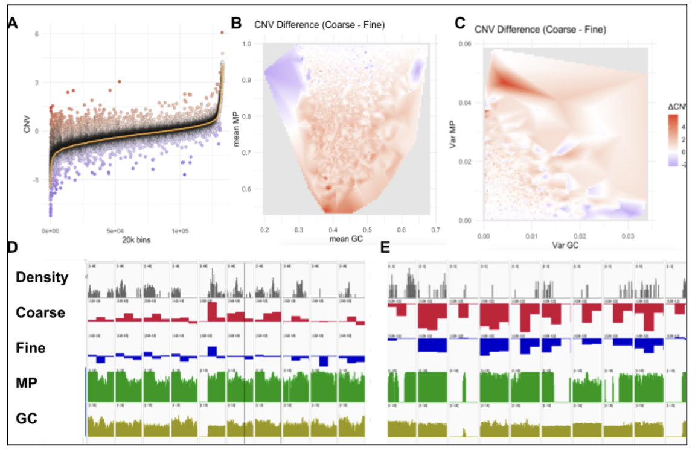
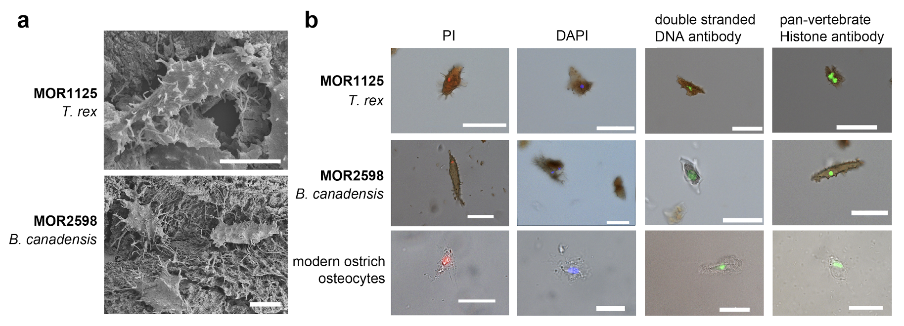

# Research Theme
>Bioinformatics views biology as a flow of information. Biological processes can be understood and predicted by analyzing how this information is transmitted and regulated. Using statistical models as a foundation, I investigate biological sequences—from DNA and RNA—to elucidate RNA processing, RNA Polymerase II dynamics, and how these processes are altered under different biological and pathological conditions.

>By integrating multi-omics, single-cell, and epigenomic data, I characterize cellular and tissue states and predict their responses to various conditions and stimuli. Gene expression, quantified by bulk RNA-seq, can be further resolved at the single-cell level to reveal detailed cellular profiles. Beyond transcription, regulatory mechanisms can be inferred from 3D genomics, where causal regulators—such as enhancers and higher-order chromatin folding—coordinate context-dependent gene expression. Dysregulation of these mechanisms is a hallmark of diseases, including cancer.

>The overarching goal of my research is to synthesize multi-omics and 3D genomic data into predictive models, enabling a systems-level understanding of cellular behavior in health and disease.

## CNV by HiChIP Project
> Predicting copy number variations (CNVs) from HiChIP data presents distinct challenges not encountered in other sequencing approaches. Unlike standard ChIP-seq, HiChIP typically lacks an input control, complicating the accurate identification of peaks and the calculation of depth of coverage (DOC) in off-target regions. Although HiChIP builds upon the Hi-C protocol, the addition of the ChIP signal introduces signal biases and 3D adjacency artifacts that require specialized modeling distinct from Hi-C–based algorithms. These complexities increase susceptibility to both Type I and Type II errors in 1D and 3D analyses. To overcome these limitations, we developed the first HiChIP-specific modifications to DOC-based CNV detection algorithms. These enhancements are designed to leverage the unique structural and signal properties of HiChIP data. Through extensive evaluation of both in-house and publicly available datasets, we identified major sources of systematic error and implemented targeted corrections, resulting in significantly improved accuracy and robustness of CNV prediction from HiChIP data.

## PCH1b Cerebellar Organoid Project
> post-transcriptional regulation of gene expression to support proper
> brain development. Understanding how post-transcriptional RNA-regulatory complexes control neuronal
> differentiation to acquire distinct subtypes within the brain will provide insight into the role of post-transcriptional
> regulatory mechanisms during brain development and novel pathomechanisms underlying RNA-mediated
> NDDs. This proposal will focus on an essential and ubiquitous RNA processing and decay machine, the RNA
> exosome, and its role in shaping neuronal identity to reveal the basis of Pontocerebellar Hypoplasia Type 1b
>  (PCH1b), a severe NDD caused by mutations in a gene encoding a structural subunit of the RNA exosome.
> link : https://github.com/hmgene/derrick 
> PI: Derrick Morton, PhD : https://gero.usc.edu/faculty/derrick-morton-phd/

## Fossil-C, Ancient Dinosaur-DNA Project
>Studies of ancient DNA have revolutionized our understanding of extinct organisms, but thus far the maximum estimated age of sequenced DNA is two million years. However, evidence for endogenous biomolecules, including proteins, lipids, and pigments have been found in much older fossils, dating to up to 195 million years. Amino acid sequence data consistent with ancient, endogenous biomolecules have been derived from specimens of the theropod Tyrannosaurus rex (MOR 1125) and the hadrosaur Brachylophosaurus canadensis (MOR 2598). Histochemical and immunological studies also identified a molecule consistent with DNA in these two ancient specimens, localized to a single point within preserved osteocytes. Here we report the sequencing and analysis of DNA extracted from osteocytes and blood vessels of T. rex and B. canadensis, liberated after demineralization of dense cortical bone. Usable sequence reads were obtained at a low recovery rate. After the removal of high-quality reads that mapped to the human genome, the remaining reads were highly fragmented, with similarities to multiple animal species including reptilian and avian genomes. Our findings support the hypothesis that DNA and histone signal from imaging, mass spectrometry, and DNA sequencing of dinosaur osteocytes are endogenously preserved biomolecules.    
> link : https://github.com/hmgene/fossil-c
> PI: Marry H. Schweitzer: https://molecularpaleo.wordpress.ncsu.edu/people/mary-h-schweitzer/

